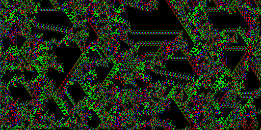

<picture>
 
</picture>

### Hello!
I'm currently a Research Scholar at the International Institute of Information Technology, Bangalore. My area of research broadly falls into the category of AI Safety. I work with CNNs. 

## GitHub Stats:
 

 

---

<!-- Proudly created with GPRM ( https://gprm.itsvg.in ) -->

<!--
**SykChw/SykChw** is a ✨ _special_ ✨ repository because its `README.md` (this file) appears on your GitHub profile.

Here are some ideas to get you started:

- 🔭 I’m currently working on ...
- 🌱 I’m currently learning ...
- 👯 I’m looking to collaborate on ...
- 🤔 I’m looking for help with ...
- 💬 Ask me about ...
- 📫 How to reach me: ...
- 😄 Pronouns: ...
- ⚡ Fun fact: ...
-->
